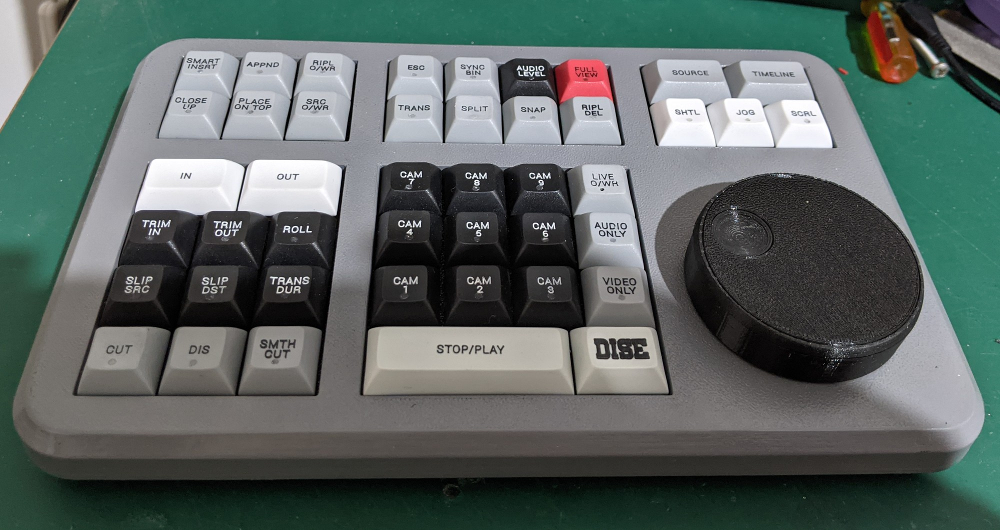

# DiSE Programmer MacOS

DIY Speed Editor hardware project plus a modern macOS configurator for programming the device, saving layouts, and managing custom Resolve-style mappings.



## What This Fork Adds

This fork keeps the original DIY hardware, firmware, PCB, and Windows programmer sources, and adds a native macOS app under `macos/` with:

- native SwiftUI configurator for macOS
- live board preview styled like the Speed Editor hardware
- profile system with built-in and saved layouts
- per-key custom board labels
- `.DiSE` import/export support
- write-to-RAM and program-to-flash flows
- app build/version display and custom app icon support
- firmware/app protocol updates for on-device key labels in firmware `v1.01+`

## Repository Layout

- `macos/` — native macOS programmer app
- `src/Firmware/` — embedded firmware for the DiSE hardware
- `src/SpeedEditorProg/` — original Windows WPF programmer
- `pcb/` — KiCad PCB files, footprints, models, and gerbers
- `mechanics/` — 3D-printable case and mechanical parts
- `media/` — photos and reference images
- `release/` — historical release assets from the original project

## Quick Start

### macOS App

From the repo root:

```bash
cd macos
./build-macos-app.sh
```

That produces:

```text
macos/build/DiSE Programmer.app
```

Useful commands:

```bash
cd macos
swift build
./build-macos-app.sh
./rebuild-and-relaunch.sh
```

The build script will use `macos/AppIcon.png` as the app icon source if present.

### Windows App

The original Windows programmer remains in:

```text
src/SpeedEditorProg
```

Open `src/SpeedEditorProg/SpeedEditorProg.sln` in Visual Studio.

### Firmware

Firmware sources live in:

```text
src/Firmware/DavinciKbd
```

This fork includes firmware-side support for on-device key labels, but you still need a working ARM embedded toolchain to compile and flash the firmware.

## Notes About Labels

- App-local custom key labels are supported by the macOS app immediately.
- True on-device label persistence requires the updated firmware protocol in this fork.
- If the device reports an older firmware, the macOS app falls back to local label storage.

## Bill of Materials

Core parts used by the project:

- 1 Blue Pill style processor board
- 1 optical encoder
- 44 Cherry MX switches and sockets
- 44 keycaps in mixed sizes
- 44 3 mm LEDs
- 1 USB-C connector
- assorted resistors and a Schottky diode

The original repo content in `media/`, `mechanics/`, and `pcb/` contains the detailed build references.

## Suggested GitHub Upload Flow

This folder is intended to be uploaded as a fresh repo. If you want to publish it from the command line:

```bash
cd '/Users/michaelsloop/Documents/Vscodeapps/DiSE-GitHub-Fork'
git init
git add .
git commit -m "Initial fork"
```

Then create a new GitHub repository and push it:

```bash
git branch -M main
git remote add origin <your-github-repo-url>
git push -u origin main
```

## License

This fork preserves the original project license in [LICENSE](LICENSE).
